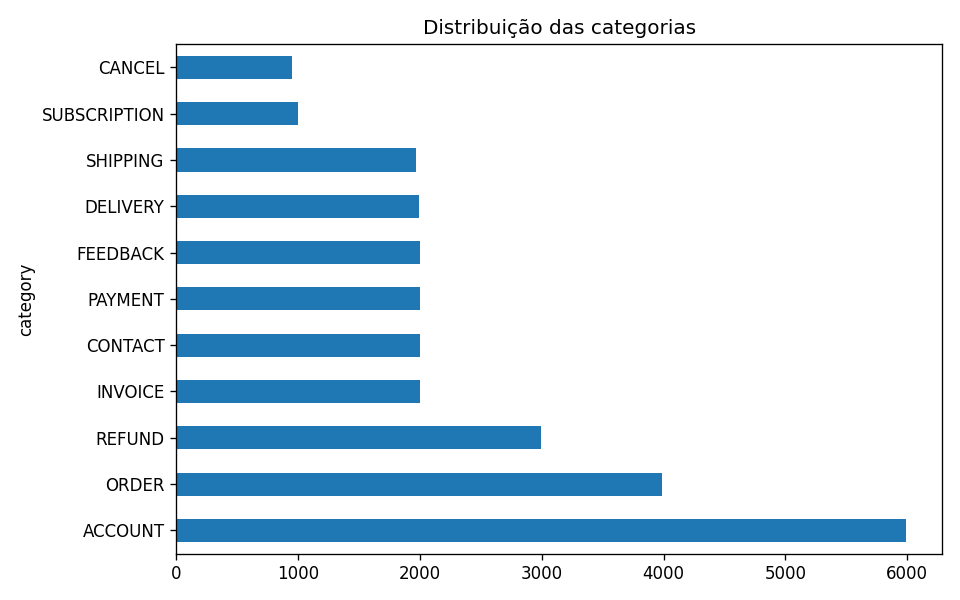
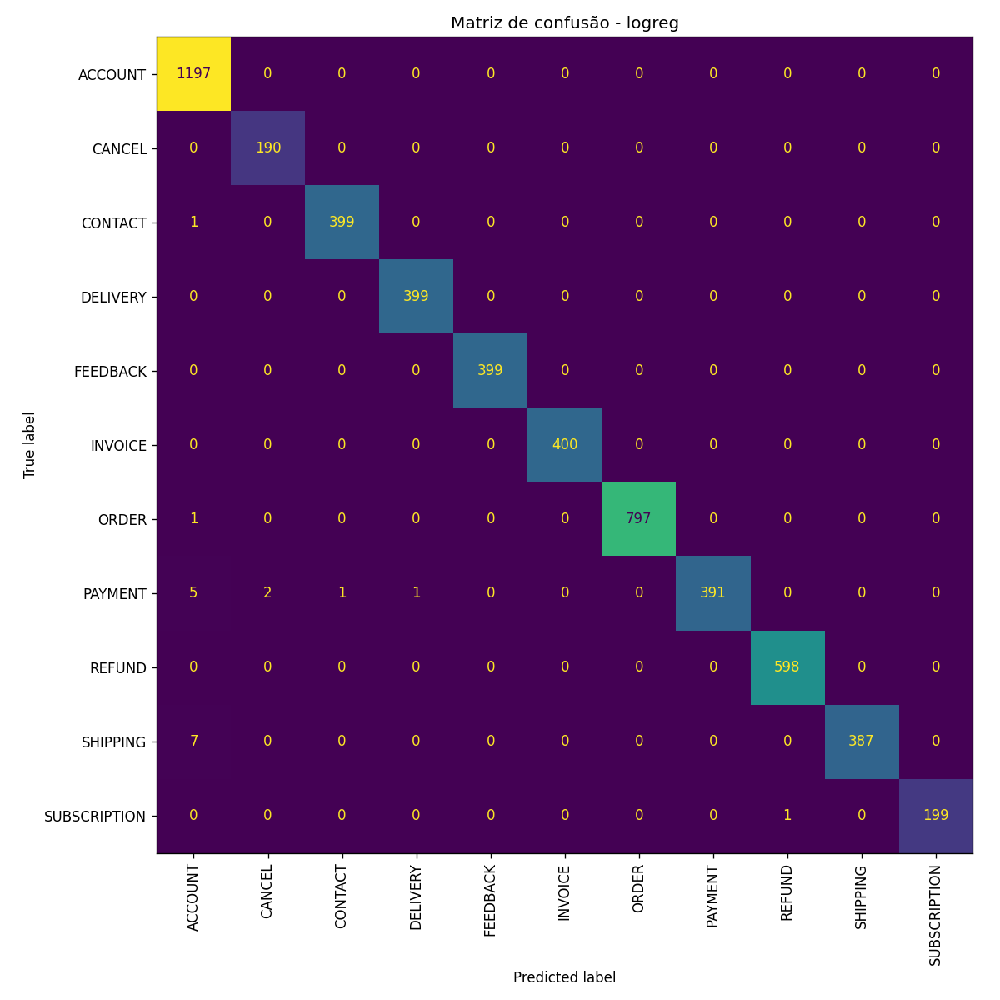
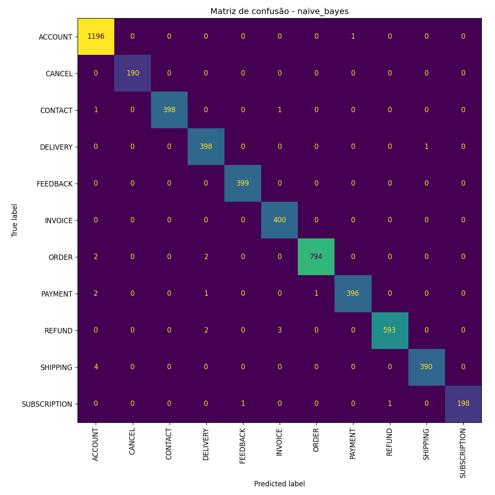
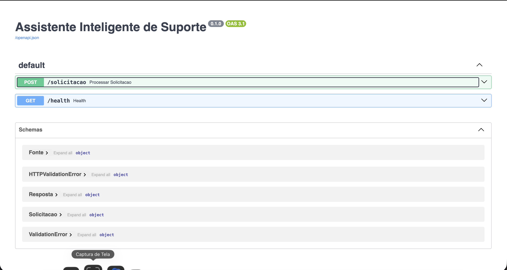
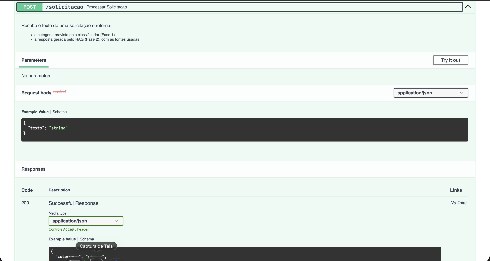
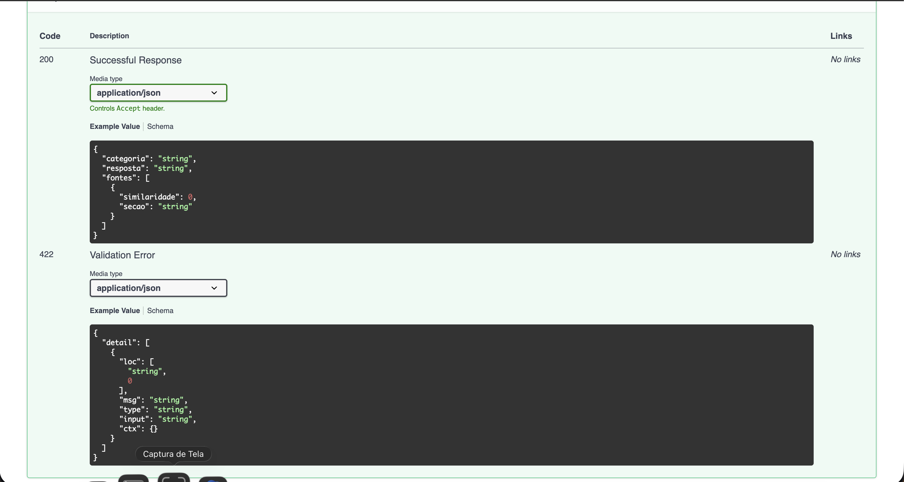

# Relatório Técnico — Assistente Inteligente de Suporte

Projeto final, Módulo 8 (IA e Aprendizado de Máquina).

---

## Resumo

Sistema ponta a ponta que recebe o texto de uma solicitação de cliente, classifica o
assunto em uma de 11 categorias e responde a dúvida com base numa base de
conhecimento via RAG, servido por uma API FastAPI.

| Componente | Resultado |
| --- | --- |
| **A** — Classificador | TF-IDF + regressão logística, **F1 macro 0,9964** (vs. 0,9958 do Naive Bayes). Split estratificado antes da vetorização, TF-IDF dentro do `Pipeline` |
| **A** — XAI | Importância de termos por coeficiente e análise dos 19 erros, que revelou dependência de artefatos do template e fragilidade a typos |
| **B** — RAG | 27 chunks indexados com `all-MiniLM-L6-v2`, busca por cosseno, geração ancorada no Gemini, proteção contra alucinação em duas camadas |
| **C** — API | `POST /solicitacao` e `GET /health`, validação Pydantic, modelo serializado carregado uma vez no startup, degradação graciosa se o LLM cair |
| **D** — Operação | Drift detectado com Kolmogorov-Smirnov em 4 cenários, custo e latência medidos, limites e pontos abertos declarados |
| Diferenciais | Fontes auditáveis no RAG, detecção de drift implementada, containerização verificada |

A conclusão mais importante deste relatório é negativa e está na
[seção 3.4](#34-discussão-honesta-por-que-0996-não-é-um-número-para-se-orgulhar): o F1
de 0,9964 mede a separabilidade de um dataset sintético, não a dificuldade de
classificar suporte real. Investiguei a hipótese de leakage, descartei com medição, e
identifiquei a causa verdadeira.

## Índice

1. [O problema](#1-o-problema)
2. [Os dados](#2-os-dados)
3. [Componente A — Classificador](#3-componente-a--classificador)
4. [Interpretabilidade e análise de erros](#4-interpretabilidade-e-análise-de-erros)
5. [Componente B — RAG](#5-componente-b--rag)
6. [Componente C — API](#6-componente-c--api)
7. [Componente D — Reflexão sobre operação](#7-componente-d--reflexão-sobre-operação)
8. [Reprodutibilidade](#8-reprodutibilidade)

## 1. O problema

Uma equipe de suporte que recebe centenas de mensagens por dia gasta tempo em duas
tarefas mecânicas: descobrir para qual setor cada mensagem vai, e procurar na base de
conhecimento a informação que responde o cliente. O sistema automatiza as duas.

Dado o texto de uma solicitação, ele devolve a categoria prevista (para roteamento) e
uma resposta fundamentada na base de conhecimento, acompanhada dos trechos que a
embasaram.

O objetivo declarado **não** é substituir o atendente, e essa escolha condiciona
várias decisões técnicas adiante. Como a saída é uma sugestão para um humano revisar,
o sistema pode assumir latência de segundos (seção 7.2) e pode errar a categoria sem
consequência direta para o cliente — em troca, tem a obrigação de ser auditável: o
atendente precisa ver de onde a resposta saiu para decidir se confia nela.

## 2. Os dados

Fonte única: [Bitext Customer Support](https://huggingface.co/datasets/bitext/Bitext-customer-support-llm-chatbot-training-dataset),
26.872 solicitações de clientes em inglês.

**Estrutura.** Cinco colunas, das quais usamos quatro:

| Coluna | Conteúdo | Uso no projeto |
| --- | --- | --- |
| `instruction` | O que o cliente escreve | Feature do classificador |
| `category` | 11 valores (ORDER, REFUND, …) | **Rótulo** do classificador |
| `intent` | 27 valores (`cancel_order`, `get_refund`, …) | Chave de agrupamento da base do RAG |
| `response` | O que o atendente responderia | **Conteúdo** da base do RAG |
| `flags` | Tags de variação linguística (`BL`, `BLQ`, `BIL`…) | Não usado |

A escolha de um dataset só, para os dois componentes, foi deliberada, e o que a
viabiliza é o dataset ter **duas colunas de texto com papéis opostos**.
`instruction` vem rotulada, então serve para aprendizado supervisionado.
`response` é texto corrido sem rótulo — inútil para classificar, mas é exatamente o
formato de uma base de conhecimento. Assim os dois componentes falam do mesmo
domínio: se o classificador roteia uma mensagem para REFUND, a base do RAG tem
conteúdo sobre reembolso.

**A hierarquia `category` ⊃ `intent` é usada nas duas pontas, em granularidades
diferentes.** ORDER contém `cancel_order`, `change_order`, `place_order` e
`track_order`. O classificador prevê `category`, porque é a granularidade do
roteamento — quem atende cancelamento também atende alteração de pedido, então
distinguir os dois não mudaria o destino da mensagem. O RAG, ao contrário, indexa por
`intent`, porque ali a granularidade fina é vantagem: `cancel_order` e `track_order`
exigem respostas distintas, e misturá-las degradaria a recuperação.

**Distribuição das 11 categorias** (desbalanceada, razão de 6,3x entre extremos):

| Categoria | N     | Categoria    | N     |
| --------- | ----- | ------------ | ----- |
| ACCOUNT   | 5.986 | FEEDBACK     | 1.997 |
| ORDER     | 3.988 | DELIVERY     | 1.994 |
| REFUND    | 2.992 | SHIPPING     | 1.970 |
| INVOICE   | 1.999 | SUBSCRIPTION | 999   |
| CONTACT   | 1.999 | CANCEL       | 950   |
| PAYMENT   | 1.998 |              |       |



**Tamanho dos textos**, saída do `describe()`:

```
count    26872.000000
mean         8.690979
std          2.605004
min          1.000000
50%          9.000000
max         16.000000
```

Mensagens curtas e, mais importante, muito uniformes: desvio de 2,6 palavras em torno
de uma média de 8,7, e nenhuma passando de 16 palavras. Essa regularidade é o primeiro
indício de que o dataset é gerado por template, e volta a ser decisiva na seção 3.4.

## 3. Componente A — Classificador

### 3.1 Preparação e cuidado com leakage

A ordem das operações foi escolhida para eliminar leakage por construção:

1. `train_test_split` com `test_size=0.2` e `stratify=y` — **antes** de qualquer
   vetorização. A estratificação preserva a proporção das 11 classes nos dois
   conjuntos, o que importa num dataset desbalanceado.
2. O `TfidfVectorizer` vive **dentro** de um `Pipeline` do scikit-learn. Isso
   garante que o vocabulário e os pesos IDF são aprendidos apenas no treino: o
   `fit()` do pipeline nunca vê o teste, e o `predict()` só aplica a transformação
   já ajustada.

Se o TF-IDF fosse ajustado no dataset inteiro antes do split, as estatísticas de
frequência do teste vazariam para o treino. O `Pipeline` é o que torna isso
impossível de acontecer por descuido.

Divisão final: **21.497 treino / 5.375 teste**.

### 3.2 Vetorização

TF-IDF com `ngram_range=(1,2)` e `min_df=3`.

Bigramas porque em suporte a unidade de sentido frequentemente tem duas palavras:
`cancel order`, `delivery address`, `payment methods`. O unigrama `order` sozinho é
ambíguo entre ORDER e CANCEL; `cancel order` não é. O `min_df=3` descarta termos que
aparecem em menos de três documentos, cortando typos raros que só inflariam a
dimensionalidade sem generalizar.

### 3.3 Duas abordagens comparadas

| Modelo                  | F1 macro   | Erros no teste |
| ----------------------- | ---------- | -------------- |
| **Regressão logística** | **0,9964** | 19 / 5.375     |
| Multinomial Naive Bayes | 0,9958     | 23 / 5.375     |

A métrica de seleção é **F1 macro**, não acurácia. Com ACCOUNT valendo 22% do
dataset e CANCEL valendo 3,5%, a acurácia é dominada pelas classes grandes: um
modelo que ignorasse CANCEL por completo perderia pouca acurácia. O F1 macro dá
peso igual a cada classe, então penaliza justamente o que queremos evitar. Foi por
isso que a decisão de qual modelo serializar usou F1 macro.

A regressão logística venceu por margem pequena (0,0006) e foi a serializada. Numa
diferença tão estreita, o desempate real foi a interpretabilidade: os coeficientes
da LogReg são diretamente legíveis como importância de termo por classe (seção 4),
o que o Naive Bayes não oferece com a mesma clareza.

Precision, recall e F1 **por classe**, saída direta do `classification_report`.
Nenhuma das 11 classes ficou abaixo de 0,98 em qualquer das três métricas:

```
============================================================
Modelo: logreg  (F1 macro: 0.9964)
============================================================
              precision    recall  f1-score   support

     ACCOUNT       0.99      1.00      0.99      1197
      CANCEL       0.99      1.00      0.99       190
     CONTACT       1.00      1.00      1.00       400
    DELIVERY       1.00      1.00      1.00       399
    FEEDBACK       1.00      1.00      1.00       399
     INVOICE       1.00      1.00      1.00       400
       ORDER       1.00      1.00      1.00       798
     PAYMENT       1.00      0.98      0.99       400
      REFUND       1.00      1.00      1.00       598
    SHIPPING       1.00      0.98      0.99       394
SUBSCRIPTION       1.00      0.99      1.00       200

    accuracy                           1.00      5375
   macro avg       1.00      1.00      1.00      5375
weighted avg       1.00      1.00      1.00      5375

============================================================
Modelo: naive_bayes  (F1 macro: 0.9958)
============================================================
              precision    recall  f1-score   support

     ACCOUNT       0.99      1.00      1.00      1197
      CANCEL       1.00      1.00      1.00       190
     CONTACT       1.00      0.99      1.00       400
    DELIVERY       0.99      1.00      0.99       399
    FEEDBACK       1.00      1.00      1.00       399
     INVOICE       0.99      1.00      1.00       400
       ORDER       1.00      0.99      1.00       798
     PAYMENT       1.00      0.99      0.99       400
      REFUND       1.00      0.99      0.99       598
    SHIPPING       1.00      0.99      0.99       394
SUBSCRIPTION       1.00      0.99      0.99       200

    accuracy                           1.00      5375
   macro avg       1.00      1.00      1.00      5375
weighted avg       1.00      1.00      1.00      5375

Melhor modelo por F1 macro: logreg (0.9964)
```

Matrizes de confusão dos dois modelos:





### 3.4 Discussão honesta: por que 0,996 não é um número para se orgulhar

Um F1 macro de 0,9964 deveria gerar desconfiança, não satisfação. Investiguei.

**Primeira hipótese: leakage por duplicatas.** O dataset tem 2.237 textos
duplicados exatos. Com o split aleatório, **604 dos 5.375 exemplos de teste (11,2%)
aparecem idênticos no conjunto de treino**. O split está corretamente implementado,
mas se o dado bruto contém repetições, o modelo é parcialmente testado em frases que
literalmente memorizou.

Refiz a avaliação removendo duplicatas antes do split:

| Cenário                        | LogReg | Naive Bayes |
| ------------------------------ | ------ | ----------- |
| Com duplicatas (26.872 linhas) | 0,9964 | 0,9958      |
| Sem duplicatas (24.635 linhas) | 0,9964 | 0,9963      |

A hipótese **não se confirmou**: o F1 não se move. As duplicatas não explicam o
resultado.

**Segunda hipótese, essa sim sustentada: o dataset é sintético e quase
linearmente separável.** Quatro evidências independentes apontam para isso, a
primeira delas conclusiva:

- **O dataset declara a própria natureza de template.** Os textos contêm
  placeholders literais, com chaves duplas, não substituídos. Um exemplo de linha
  crua, na íntegra:

  ```
  instruction : question about cancelling order {{Order Number}}
  category    : ORDER
  intent      : cancel_order
  response    : I've understood you have a question regarding canceling order
                {{Order Number}}, and I'm here to provide you with the information
                you need. Please go ahead and ask your question, and I'll do my
                best to assist you.
  ```

  Medindo a prevalência: **24,8% das `instruction` (6.670 de 26.872) e 48,4% das
  `response` (13.006) contêm `{{...}}`**. Não é inferência sobre o estilo do texto —
  é o mecanismo de geração aparecendo no dado.

- **Uniformidade dos textos.** Média de 8,7 palavras com desvio de 2,6, e máximo de
  16. Mensagens reais de suporte não têm essa regularidade — variam de "help" a
  parágrafos inteiros. É o efeito esperado de gerar frases a partir de um número
  pequeno de moldes.
- **Os termos discriminantes são quase um dicionário.** A seção 4 mostra que
  `account` prediz ACCOUNT, `refund` prediz REFUND, `invoice` prediz INVOICE. A
  tarefa degenerou em busca de palavra-chave; quase não há ambiguidade lexical para
  o modelo resolver.
- **O modelo aprendeu artefatos do template.** Entre os 8 termos mais indicativos de
  INVOICE estão os literais `00108`, `37777`, `85632`, `12588`. Com a evidência dos
  placeholders, isso fica explicado: são casos em que o `{{Invoice Number}}` **foi**
  preenchido, e o gerador sorteou de um conjunto pequeno de valores. O modelo decorou
  esses valores específicos. Não é conhecimento linguístico, e não generalizaria para
  uma fatura com outro número.

**Conclusão.** 0,9964 mede a separabilidade do Bitext, não a dificuldade de
classificar suporte real. Em produção, com linguagem espontânea, gírias, typos,
mensagens multi-assunto e categorias mal definidas na fronteira, esse número cairia
de forma substancial. A seção 7.1 quantifica parte dessa queda: basta introduzir
30% de erros de digitação para a confiança média do modelo cair de 0,942 para
0,812.

O valor do projeto está no pipeline — split correto, métrica adequada ao
desbalanceamento, interpretabilidade, monitoramento — e não no F1.

## 4. Interpretabilidade e análise de erros

### 4.1 Importância de features

Os coeficientes da regressão logística indicam quais termos mais empurram um texto
para cada classe. Extraindo os 8 maiores por categoria:

| Categoria    | Termos mais indicativos                               |
| ------------ | ----------------------------------------------------- |
| ACCOUNT      | account, signup, user, registration, profile          |
| CANCEL       | termination, cancellation, withdrawal, penalty, early |
| CONTACT      | customer, agent, contact, speak, talk                 |
| DELIVERY     | delivery, shipment, arrive, shipping, methods         |
| FEEDBACK     | feedback, claim, reclamation, complaint, file         |
| INVOICE      | invoice, bill, `00108`, `37777`, `85632`              |
| ORDER        | order, purchase, order number, several, product       |
| PAYMENT      | payment, payments, modalities, payment methods        |
| REFUND       | refund, money, reimbursement, rebate, compensation    |
| SHIPPING     | address, delivery address, shipping address           |
| SUBSCRIPTION | newsletter, subscription, unsubscribe, corporate      |

A tabela acima está resumida aos 5 primeiros por legibilidade. Saída completa com os
8 termos de cada categoria, direto do script:

```
Top 8 termos mais indicativos de cada categoria (LogReg):
  ACCOUNT: account, signup, user, registration, profile, standard, pro, platinum
  CANCEL: termination, cancellation, withdrawal, the, penalty, early, charge, charges
  CONTACT: customer, agent, contact, speak, talk, with, somebody, someone
  DELIVERY: delivery, shipment, arrive, shipping, methods, options, when, delivery city
  FEEDBACK: feedback, claim, reclamation, complaint, file, leave, lodge, review
  INVOICE: invoice, bill, 00108, 37777, 85632, 12588, from, person name
  ORDER: order, purchase, order number, number, several, some, product, article
  PAYMENT: payment, payments, with payments, modalities, payment methods, with, online, options
  REFUND: refund, money, reimbursement, rebate, compensation, refunds, status, reimbursements
  SHIPPING: address, delivery address, shipping, shipping address, delivery, the address, my address, my
  SUBSCRIPTION: newsletter, subscription, corporate, to your, unsubscribe, the newsletter, to the, your
```

O resultado é coerente com o domínio e confirma que os bigramas pegaram sentido
real: `delivery address` e `shipping address` discriminam SHIPPING, enquanto
`delivery` sozinho puxa para DELIVERY. A distinção entre essas duas classes é
justamente onde o modelo mais erra (4.2).

Os números de fatura em INVOICE são o achado mais útil desta análise, e é um achado
negativo: sem olhar os coeficientes, não haveria como suspeitar que o modelo estava
se apoiando em placeholders.

### 4.2 Análise de erros

19 erros em 5.375. A distribuição deles não é aleatória:

| Real → Previsto       | N   |
| --------------------- | --- |
| SHIPPING → ACCOUNT    | 7   |
| PAYMENT → ACCOUNT     | 5   |
| PAYMENT → CANCEL      | 2   |
| CONTACT → ACCOUNT     | 1   |
| ORDER → ACCOUNT       | 1   |
| PAYMENT → CONTACT     | 1   |
| PAYMENT → DELIVERY    | 1   |
| SUBSCRIPTION → REFUND | 1   |

Saída direta do script (o pandas omite o rótulo `PAYMENT` repetido nas linhas
seguintes do mesmo grupo):

```
Total de erros no teste: 19

Pares (real -> previsto) mais frequentes:
real          previsto
SHIPPING      ACCOUNT     7
PAYMENT       ACCOUNT     5
              CANCEL      2
CONTACT       ACCOUNT     1
ORDER         ACCOUNT     1
PAYMENT       CONTACT     1
              DELIVERY    1
SUBSCRIPTION  REFUND      1
```

**Padrão 1: 14 dos 19 erros vão para ACCOUNT**, a classe majoritária (22% do
dataset). Esse é o comportamento clássico de um classificador quando o sinal
desaparece: sem evidência no vetor, ele cai no prior.

**Padrão 2: o sinal desaparece por ruído de digitação.** Os exemplos errados
mostram exatamente isso:

| Texto                                                 | Real     | Previsto |
| ----------------------------------------------------- | -------- | -------- |
| `help me to check the acceptedpayment modalities`     | PAYMENT  | CANCEL   |
| `where do i report an issue with paynents`            | PAYMENT  | ACCOUNT  |
| `i dont know what i need to do to correct theaddress` | SHIPPING | ACCOUNT  |
| `can i pay witj visa`                                 | PAYMENT  | ACCOUNT  |

Amostra aleatória de 5 erros, saída direta do script:

```
Alguns exemplos de erro para discutir no relatório:
                                                  texto      real previsto
5177    help me to check the acceptedpayment modalities   PAYMENT   CANCEL
18116          where do i report an issue with paynents   PAYMENT  ACCOUNT
2473  i dont know what i need to do to correct theaddress SHIPPING  ACCOUNT
166   would you give me information about cancelling orders?  ORDER  ACCOUNT
4949                                can i pay witj visa   PAYMENT  ACCOUNT
```

`paynents`, `witj`, `acceptedpayment`, `theaddress`: palavra concatenada ou letra
trocada. O token não existe no vocabulário TF-IDF, é descartado, e o texto perde a
única palavra que carregava a informação. Essa é a fragilidade estrutural do TF-IDF
— ele trabalha com tokens exatos e não tem noção de similaridade ortográfica.

**Mitigação possível**, não implementada aqui: acrescentar features de n-gramas de
caracteres (`analyzer="char_wb"`, `ngram_range=(3,5)`). `paynents` e `payments`
compartilham os trigramas `pay`, `ayn`/`aym`, `nts`, então o sinal sobreviveria à
troca de letra. É a próxima coisa que eu faria neste componente.

O único erro fora desses dois padrões é `ORDER → ACCOUNT` em "would you give me
information about cancelling orders?", que é genuinamente ambíguo — um humano
poderia rotular como CANCEL.

## 5. Componente B — RAG

### 5.1 Base de conhecimento

Construída a partir da coluna `response` do Bitext. O dataset tem 27 intenções
(`cancel_order`, `get_refund`, `check_refund_policy`, …) agrupadas nas 11
categorias. Para cada par (categoria, intenção) tomei **uma** resposta
representativa, gerando um "manual de atendimento" de 27 seções e ~2.400 palavras
em `data/base_conhecimento.md`.

Cada seção recebe um cabeçalho `## [CATEGORIA] intencao`, o que serve a dois
propósitos: delimita o chunk e, como o cabeçalho é devolvido no campo `fontes`, dá
ao atendente uma referência legível de onde a resposta saiu.

**Limitação reconhecida:** 2.400 palavras é uma base enxuta. Ela cobre bem as 27
intenções do dataset, mas qualquer pergunta ligeiramente fora delas cai no
curto-circuito da seção 5.3. Uma base de produção teria políticas completas, prazos,
exceções e casos de borda. Ampliar seria simples — bastaria tomar 3 ou 4 respostas
por intenção em vez de uma, ou anexar FAQ e termos de uso reais.

### 5.2 Chunking, embeddings e busca

O chunking segue a estrutura semântica em vez de cortar por número de palavras: cada
seção `##` já é uma unidade coesa, sobre uma única intenção. Cortar em janelas de
200 palavras partiria respostas no meio; aqui não há esse risco.

Embeddings com `all-MiniLM-L6-v2` (384 dimensões), normalizados. Com vetores
normalizados o produto escalar **é** a similaridade de cosseno, então a busca inteira
é um `emb_chunks @ emb_pergunta` — uma multiplicação de matriz de 27×384 por 384.
Não há necessidade de um vector store: com 27 chunks, a busca exaustiva é
instantânea e evita uma dependência.

A base e as perguntas ficam em inglês porque o `all-MiniLM-L6-v2` tem desempenho
melhor nesse idioma; o prompt instrui o LLM a responder em português. Uma base em
português exigiria um modelo de embeddings multilíngue.

### 5.3 Proteção contra alucinação: duas camadas

**Camada 1 — curto-circuito por limiar.** Se a maior similaridade entre a pergunta
e os 27 chunks for menor que **0,30**, o sistema devolve
`"Não encontrei essa informação na base de conhecimento."` sem chamar o LLM.

O limiar de 0,30 foi calibrado observando as similaridades reais: perguntas dentro
do domínio recuperam o melhor chunk entre 0,55 e 0,70 (a pergunta
"How do I cancel my order?" recupera `[ORDER] cancel_order` a 0,683), enquanto
"What is the capital of France?" não passa de 0,30 contra nenhuma seção. A folga
entre as duas faixas é confortável.

**Camada 2 — prompt ancorado.** Quando o LLM é chamado, o prompt entrega os 3
chunks mais similares como contexto e instrui a responder apenas com base neles,
com a mesma frase de escape se o contexto não tiver relação. É a rede de segurança
para o caso de a similaridade passar do limiar mas o conteúdo não servir.

A camada 1 não é redundante em relação à camada 2 — ela é o que evita gastar
latência e cota de LLM numa pergunta que já se sabe fora de escopo. Ver 7.2.

**Demonstração das duas camadas.** Saída de `python fase2_rag.py`, com duas
perguntas dentro do domínio e uma fora:

```
Total de chunks: 27
Índice pronto: 27 chunks x 384 dimensões

======================================================================
PERGUNTA: How do I cancel my order?

RESPOSTA: Para que eu possa te ajudar a cancelar o seu pedido, por favor,
informe o número do pedido e faça a sua pergunta específica sobre o
cancelamento. Estarei à disposição para te fornecer as informações
necessárias e te auxiliar no que for preciso.
FONTES RECUPERADAS (similaridade | seção):
  0.683 | ## [ORDER] cancel_order
  0.55 | ## [CANCEL] check_cancellation_fee
  0.433 | ## [ORDER] place_order

======================================================================
PERGUNTA: I want to get a refund, what should I do?

RESPOSTA: Para dar início ao processo de reembolso, por favor, forneça mais
detalhes sobre a situação ou incidente específico que motivou a sua
solicitação. Com essas informações, poderei orientar você com os passos
exatos e adequados ao seu caso.

Além disso, você pode consultar a nossa política de reembolso acessando o
nosso site e navegando até a seção "FAQ" ou "Termos e Condições", onde
encontrará detalhes sobre o processo de reembolso, critérios de
elegibilidade e requisitos específicos.
FONTES RECUPERADAS (similaridade | seção):
  0.617 | ## [REFUND] check_refund_policy
  0.551 | ## [REFUND] get_refund
  0.549 | ## [REFUND] track_refund

======================================================================
PERGUNTA: What is the capital of France?

RESPOSTA: Não encontrei essa informação na base de conhecimento.
FONTES RECUPERADAS (similaridade | seção):
```

Os três casos mostram o comportamento desejado: recuperação relevante (as seções
recuperadas são exatamente as do assunto perguntado), resposta ancorada no contexto
(a segunda resposta reproduz a orientação da base sobre onde consultar a política,
sem inventar prazos ou percentuais), e a proteção contra alucinação disparando na
pergunta fora do domínio — sem nenhuma fonte listada, porque nenhuma passou do
limiar.

### 5.4 Auditabilidade (diferencial)

Toda resposta vem acompanhada dos trechos que a embasaram e da similaridade de cada
um:

```json
"fontes": [
  {"similaridade": 0.683, "secao": "## [ORDER] cancel_order"},
  {"similaridade": 0.55,  "secao": "## [CANCEL] check_cancellation_fee"},
  {"similaridade": 0.433, "secao": "## [ORDER] place_order"}
]
```

Isso muda a natureza do sistema. Sem as fontes, o atendente precisa confiar na
resposta; com elas, ele confere em segundos se o RAG puxou o trecho certo. E quando
o sistema erra, as fontes dizem se o problema foi na recuperação (trecho errado) ou
na geração (trecho certo, resposta ruim) — sem isso, depurar um RAG é adivinhação.

## 6. Componente C — API

FastAPI com dois endpoints. `POST /solicitacao` recebe o texto e devolve categoria,
resposta e fontes; `GET /health` para checagem de disponibilidade.

A documentação interativa em `/docs` é gerada automaticamente a partir dos tipos —
não há um único arquivo de especificação escrito à mão. Os cinco schemas listados
(`Solicitacao`, `Resposta`, `Fonte`, `ValidationError`, `HTTPValidationError`) saem
diretamente dos modelos Pydantic do código:



Detalhe do endpoint principal, com a descrição vinda do docstring da função e o
contrato do corpo da requisição:



**Validação de entrada.** Pydantic com `Field(min_length=3)`. Um texto de 2
caracteres é rejeitado com **422** e o detalhe do campo, antes de chegar ao modelo:

```json
{
  "detail": [
    {
      "type": "string_too_short",
      "loc": ["body", "texto"],
      "msg": "String should have at least 3 characters"
    }
  ]
}
```

A saída também é tipada (`response_model=Resposta`), o que garante o contrato e
alimenta a documentação automática em `/docs`. Os dois códigos de resposta possíveis
aparecem documentados com o schema de cada um — o **200** com `categoria`, `resposta`
e a lista de `fontes`, e o **422** com o detalhe da falha de validação:



Vale notar que o 422 não foi declarado em nenhum lugar do código: o FastAPI o deriva
do fato de o corpo ser um modelo Pydantic com restrição. É o mesmo mecanismo que
valida a entrada em tempo de execução e que documenta a validação para quem consome
a API.

**Carregamento único no startup.** O `lifespan` do FastAPI carrega o `.joblib`,
instancia o modelo de embeddings e indexa os 27 chunks **uma vez**, guardando tudo
num dicionário reutilizado por todas as requisições. Treinar — ou mesmo só
recarregar — por requisição inviabilizaria o serviço: o `SentenceTransformer` leva
segundos para instanciar.

**Robustez.** Os caminhos dos artefatos são resolvidos a partir da localização de
`api/main.py`, não do diretório de trabalho, então o `uvicorn` pode ser chamado de
qualquer lugar. Se um artefato faltar, o startup falha com uma mensagem que diz qual
script rodar. E se o Gemini bloquear a geração por filtro de segurança (`resp.text`
vem `None`), a resposta cai na mensagem padrão em vez de estourar um 500.

**Degradação graciosa na falha do LLM.** Esta proteção foi acrescentada depois de um
achado durante o teste do contêiner: uma requisição dentro do domínio retornou
**500 Internal Server Error**, e o log mostrou a causa real —
`ServerError: 503 UNAVAILABLE ... This model is currently experiencing high demand`.
Não era bug do código, era o Gemini momentaneamente indisponível. Mas o
comportamento estava errado: o LLM é a única dependência externa do sistema e a que
mais falha (cota, 503 por demanda, rede), e uma falha dela derrubava a requisição
inteira — jogando fora a classificação e a recuperação, que já tinham funcionado.

A API agora captura `genai.errors.APIError` e responde **200** com a categoria, as
fontes recuperadas e um aviso de que a geração não saiu:

```console
$ curl -X POST .../solicitacao -d '{"texto":"How do I cancel my order?"}'
   # contêiner rodando com uma chave inválida, para forçar a falha

{"categoria":"ORDER",
 "resposta":"Não foi possível gerar a resposta agora: o serviço de geração está
 temporariamente indisponível. Os trechos da base relevantes para esta
 solicitação estão listados em 'fontes'.",
 "fontes":[{"similaridade":0.683,"secao":"## [ORDER] cancel_order"},
           {"similaridade":0.55,"secao":"## [CANCEL] check_cancellation_fee"},
           {"similaridade":0.433,"secao":"## [ORDER] place_order"}]}
[HTTP 200 | 0.442357s]

# no log do contêiner:
[WARN] Gemini indisponível (400): geração degradada.
```

O atendente continua recebendo o roteamento correto e os trechos certos da base —
degradado, mas útil. É a diferença entre um serviço que fica indisponível junto com
sua dependência e um que perde só a parte que dependia dela.

### 6.1 Verificação ponta a ponta

| Caso              | Entrada                          | Resultado                                      |
| ----------------- | -------------------------------- | ---------------------------------------------- |
| Dentro do domínio | `How do I cancel my order?`      | 200, categoria ORDER, resposta com 3 fontes    |
| Fora do domínio   | `What is the capital of France?` | 200, mensagem de "não encontrei", `fontes: []` |
| Entrada inválida  | `ab`                             | 422 com detalhe do campo                       |
| Disponibilidade   | `GET /health`                    | 200, `{"status":"ok"}`                         |

Transcrição completa das três requisições, com o servidor rodando via
`uvicorn api.main:app`. Cada bloco traz o comando exato e a resposta integral.

**Requisição 1 — solicitação dentro do domínio.** O caminho completo: classificador,
busca semântica e geração pelo LLM.

```console
$ curl -X POST http://127.0.0.1:8000/solicitacao \
    -H "Content-Type: application/json" \
    -d '{"texto": "How do I cancel my order?"}'
```

```json
{
  "categoria": "ORDER",
  "resposta": "Para que eu possa ajudar você a cancelar o seu pedido, por favor, informe o número do pedido. Estou à disposição para tirar suas dúvidas e farei o possível para auxiliá-lo(a) nesse processo.",
  "fontes": [
    { "similaridade": 0.683, "secao": "## [ORDER] cancel_order" },
    { "similaridade": 0.55,  "secao": "## [CANCEL] check_cancellation_fee" },
    { "similaridade": 0.433, "secao": "## [ORDER] place_order" }
  ]
}
```

`HTTP 200` em **4,638 s**. A categoria ORDER está correta, e as fontes mostram que a
seção recuperada com maior similaridade é exatamente `cancel_order` — a recuperação
acertou o alvo, não só um vizinho temático.

**Requisição 2 — pergunta fora do domínio.** Aciona o curto-circuito por limiar, sem
chamar o LLM.

```console
$ curl -X POST http://127.0.0.1:8000/solicitacao \
    -H "Content-Type: application/json" \
    -d '{"texto": "What is the capital of France?"}'
```

```json
{
  "categoria": "ACCOUNT",
  "resposta": "Não encontrei essa informação na base de conhecimento.",
  "fontes": []
}
```

`HTTP 200` em **0,027 s** — 170 vezes mais rápido que a requisição 1, porque nenhuma
chamada externa foi feita. O `fontes: []` é a assinatura do curto-circuito: nenhum dos
27 chunks passou do limiar de 0,30, então nem entraram na resposta.

**Requisição 3 — entrada inválida.** Rejeitada pelo Pydantic antes de chegar ao
modelo.

```console
$ curl -X POST http://127.0.0.1:8000/solicitacao \
    -H "Content-Type: application/json" \
    -d '{"texto": "ab"}'
```

```json
{
  "detail": [
    {
      "type": "string_too_short",
      "loc": ["body", "texto"],
      "msg": "String should have at least 3 characters",
      "input": "ab",
      "ctx": { "min_length": 3 }
    }
  ]
}
```

`HTTP 422` em **0,001 s**. Três ordens de magnitude mais rápido que o caminho
completo, porque a requisição não passa da camada de validação: nem o classificador
nem os embeddings são acionados. O corpo do erro identifica o campo (`loc`), a regra
violada (`type`) e o valor recebido (`input`).

Vale notar um detalhe da requisição 2: a categoria devolvida é ACCOUNT, porque o
classificador **sempre** devolve uma das 11 classes — ele não tem opção de "nenhuma".
Para "What is the capital of France?" essa predição é lixo, e é o RAG que salva a
resposta ao dizer que não sabe. Isso ilustra a assimetria entre os dois componentes:
o RAG sabe reconhecer que está fora do domínio, o classificador não. Um sistema de
produção usaria a confiança do classificador (seção 7.1) para marcar a categoria como
incerta em vez de afirmá-la.

## 7. Componente D — Reflexão sobre operação

### 7.1 Monitoramento e drift

Em produção não há rótulo no momento da inferência. Não é possível calcular F1 em
tempo real, e é aí que a maioria dos sistemas de ML apodrece silenciosamente: o
modelo continua respondendo com confiança enquanto a qualidade cai.

O que **é** observável são distribuições. Implementei a detecção em
`monitoramento_drift.py`, usando o **teste de Kolmogorov-Smirnov** para comparar o
tráfego atual com o perfil de referência do treino. KS é não paramétrico, não assume
normalidade, e devolve um p-valor: p < 0,05 significa que as duas amostras
dificilmente vêm da mesma distribuição.

Dois sinais monitorados: a **confiança do modelo** (máximo da `predict_proba`) e o
**tamanho do texto** em palavras. Resultados medidos:

| Cenário simulado                | Confiança (média) | KS confiança | Tamanho    | Veredito  |
| ------------------------------- | ----------------- | ------------ | ---------- | --------- |
| Controle (mesma distribuição)   | 0,942 → 0,945     | p = 0,41     | p = 0,66   | sem drift |
| 30% de erros de digitação       | 0,942 → **0,812** | p = 7e-134   | p = 0,96   | **drift** |
| Textos mais longos (canal novo) | 0,942 → **0,742** | p < 1e-300   | p ≈ 0      | **drift** |
| Assunto fora das 11 classes     | 0,942 → **0,425** | p ≈ 0        | p = 5e-270 | **drift** |

Saída direta de `python monitoramento_drift.py`:

```
==================================================================
CENÁRIO: controle - mesma distribuição
==================================================================
  confianca    média   0.942 ->   0.945 | KS=0.0243 p=4.11e-01 | estável
  n_palavras   média   8.753 ->   8.661 | KS=0.0200 p=6.58e-01 | estável
  --> Veredito: sem drift detectado

==================================================================
CENÁRIO: drift de ruído - erros de digitação
==================================================================
  confianca    média   0.942 ->   0.812 | KS=0.3360 p=7.38e-134 | DRIFT
  n_palavras   média   8.753 ->   8.700 | KS=0.0140 p=9.55e-01 | estável
  --> Veredito: ALERTA, investigar

==================================================================
CENÁRIO: drift de canal - textos mais longos
==================================================================
  confianca    média   0.942 ->   0.742 | KS=0.6867 p=9.49e-322 | DRIFT
  n_palavras   média   8.753 ->  32.620 | KS=1.0000 p=0.00e+00 | DRIFT
  --> Veredito: ALERTA, investigar

==================================================================
CENÁRIO: drift de assunto - categoria fora do treino
==================================================================
  confianca    média   0.942 ->   0.425 | KS=0.9715 p=0.00e+00 | DRIFT
  n_palavras   média   8.753 ->  10.400 | KS=0.4725 p=5.20e-270 | DRIFT
  --> Veredito: ALERTA, investigar
```

Três leituras importam aqui:

- **O cenário de controle não dispara.** Um monitor que acusa drift em tráfego
  normal é pior que nenhum monitor, porque treina a equipe a ignorar o alerta.
- **Os dois sinais são complementares.** O drift de digitação derruba a confiança
  mas não muda o tamanho do texto; só o primeiro sinal o detecta. O drift de canal
  move os dois. Monitorar apenas o tamanho perderia o caso mais realista.
- **O caso mais perigoso é o mais detectável.** Assunto novo — a empresa lança um
  produto e chega uma solicitação que não cabe em nenhuma das 11 categorias — derruba
  a confiança de 0,942 para 0,425. O modelo vai prever alguma classe existente e o
  roteamento vai para o setor errado; nenhuma métrica sem rótulo perceberia, mas a
  confiança grita.

**Como isso viraria operação:** salvar o perfil de referência versionado junto com
o `.joblib`; logar predição, confiança e tamanho a cada requisição; job diário
rodando KS contra a referência. E o ponto que considero mais importante: **o alerta
não deve retreinar sozinho.** Ele deve disparar amostragem — separar ~200
solicitações do período, rotular à mão, medir F1 de verdade — e só então decidir por
retreino. Retreino automático em cima de um sinal indireto é como assinar cheque em
branco.

### 7.2 Custo e latência do RAG

Latências medidas nas execuções da seção 6.1, em duas rodadas separadas:

| Caminho                                       | Latência              |
| --------------------------------------------- | --------------------- |
| Validação Pydantic rejeitando a entrada (422) | **0,001 s**           |
| Classificador (TF-IDF + LogReg)               | poucos milissegundos  |
| Busca semântica (27 chunks)                   | ~10 ms                |
| Curto-circuito (fora do domínio, sem LLM)     | **0,027 – 0,115 s**   |
| Pipeline completo com chamada ao Gemini       | **4,64 – 9,56 s**     |

As duas últimas linhas são faixas porque as medi em momentos diferentes e os valores
variaram bastante: a mesma requisição "How do I cancel my order?" levou 9,56 s numa
rodada e 4,64 s em outra. A variação não está no nosso código — o classificador e a
busca são determinísticos e somam milissegundos. Ela está inteira na chamada externa,
e é uma característica de operar sobre um LLM de terceiros: a latência é do provedor,
oscila com a carga dele, e não é controlável do nosso lado. É o mesmo motivo que
produziu o `503 UNAVAILABLE` da seção 6.

**Consequência para dimensionamento:** não faz sentido prometer um SLA de latência
apertado para o caminho que passa pelo LLM. O que se pode prometer é o caminho que
não passa por ele.

A chamada ao LLM domina o tempo total em duas ordens de magnitude — mesmo no melhor
caso medido, o caminho com LLM é **~170x mais lento** que o curto-circuito. Isso tem
três consequências práticas:

**O curto-circuito por limiar é uma decisão de custo, não só de qualidade.** Toda
pergunta fora do domínio que ele intercepta é uma chamada de API não gasta e vários
segundos economizados. Numa operação real, onde parte do tráfego é ruído, isso é a
diferença entre viável e caro.

**Alguns segundos de espera são aceitáveis no design escolhido, e não seriam em
outro.** O sistema sugere resposta para um atendente humano, que leva mais tempo que
isso só para ler a mensagem do cliente. Se o mesmo pipeline fosse exposto direto ao
cliente num chat, um silêncio que às vezes é de 5 e às vezes de 10 segundos seria
inaceitável — e o problema não seria só a média, seria a imprevisibilidade. A saída
nesse cenário seria streaming da resposta ou um modelo menor.

**Quando o LLM não vale a pena.** Para as 27 intenções que a base já cobre com uma
resposta canônica, devolver o texto do chunk recuperado seria instantâneo, gratuito e
sem risco de alucinação. O LLM agrega valor quando a pergunta combina informação de
mais de um chunk, ou está fraseada de um jeito que a resposta canônica não cobre. Uma
evolução natural seria uma banda: acima de ~0,85 de similaridade devolver o chunk
direto; entre 0,30 e 0,85 chamar o LLM; abaixo de 0,30 dizer que não sabe.

O tier gratuito do Gemini tem limite de requisições por minuto, e a
indisponibilidade não é hipotética: durante o teste do contêiner o modelo devolveu
`503 UNAVAILABLE` por demanda alta (seção 6). Hoje a API degrada graciosamente nesse
caso — responde 200 com categoria e fontes, sem a resposta gerada. O que ainda falta
para produção é fila com retry e backoff exponencial, para que uma indisponibilidade
de poucos segundos seja absorvida em vez de repassada ao usuário.

### 7.3 Limites honestos do sistema

**O F1 não descreve a realidade.** Discutido na seção 3.4: 0,9964 mede a
separabilidade de um dataset sintético. Não tenho uma estimativa confiável do
desempenho em mensagens reais, e não é honesto apresentar esse número como se
tivesse.

**O sistema é monolíngue.** Classificador treinado em inglês, embeddings com melhor
desempenho em inglês. Uma solicitação em português seria classificada
essencialmente ao acaso.

**A base do RAG cobre 27 intenções e nada além.** Não há política de garantia,
prazo de troca, exceção regional. Perguntas legítimas de suporte fora dessas 27
recebem "não encontrei" — o comportamento é seguro, mas a cobertura é estreita.

**Não há avaliação quantitativa do RAG.** A recuperação foi verificada
qualitativamente em algumas perguntas. Não construí um conjunto de pares
pergunta-trecho-correto para medir recall@k, então "a busca funciona" é uma
afirmação sobre os casos que testei, não uma métrica.

**O classificador quebra com typo.** Consequência direta do TF-IDF por token exato
(seção 4.2). N-gramas de caracteres resolveriam boa parte.

**Não há autenticação, rate limiting ou log estruturado.** A API está no nível de
prova de conceito. O monitoramento descrito em 7.1 pressupõe log por requisição, que
é o primeiro item a implementar antes de qualquer uso real.

**Categoria nova é ponto cego por construção.** O classificador só sabe prever as 11
classes que viu. A detecção de drift avisa que algo mudou, mas a correção — definir
a nova categoria, rotular exemplos, retreinar — é trabalho humano.

### 7.4 Pontos abertos e próximos passos

Os itens abaixo foram identificados durante o desenvolvimento e **deixados em aberto
de forma deliberada**, não por descuido. Cada um traz o motivo e a correção conhecida.

| # | Ponto aberto | Por que ficou aberto | Correção |
| --- | --- | --- | --- |
| 1 | **Imagem Docker de 3,29 GB.** O wheel padrão do `torch` para Linux embute as bibliotecas CUDA — o build baixou `cuda-toolkit` e `cuda-bindings`, que nunca são usados, porque a inferência dos embeddings roda em CPU | Trocar o wheel exigiria um `requirements.txt` diferente do ambiente onde todas as métricas deste relatório foram medidas. Preferi manter a correspondência exata entre o que foi medido e o que está declarado | Instalar o wheel CPU-only: `pip install torch --extra-index-url https://download.pytorch.org/whl/cpu`, ou pinar `torch==2.8.0+cpu`. Reduz a imagem a uma fração do tamanho, sem efeito sobre o resultado |
| 2 | **Base do RAG com 2.400 palavras**, no limite inferior do que justifica chunking | A base é derivada do dataset, e há só uma resposta canônica por intenção. Ampliar com FAQ externo quebraria a coerência de fonte única defendida na seção 2 | Tomar 3-4 respostas por intenção em vez de uma (`groupby().head(4)` em vez de `.iloc[0]`), triplicando a base sem sair do mesmo dataset |
| 3 | **Fragilidade a typos** no classificador (seção 4.2) | Adicionar features de caractere mudaria o modelo depois de as métricas estarem medidas e o `.joblib` serializado | `FeatureUnion` combinando o TF-IDF de palavras com um `analyzer="char_wb"`, `ngram_range=(3,5)`. `paynents` e `payments` compartilham trigramas, então o sinal sobrevive |
| 4 | **Sem métrica de recuperação do RAG** (recall@k) | Exigiria construir à mão um conjunto de pares pergunta → trecho correto, que é trabalho de anotação, não de código | Escrever ~30 perguntas com o chunk esperado e medir recall@3. É o próximo passo mais valioso para o Componente B |
| 5 | **Sem retry com backoff** na chamada ao LLM (seção 7.2) | A degradação graciosa já evita o 500, que era o problema urgente | `tenacity` já vem como dependência transitiva do `google-genai`; bastaria decorar a chamada com retry exponencial em `ServerError` |
| 6 | **Sem log estruturado por requisição** | O monitoramento da seção 7.1 foi validado offline, com simulação | Logar predição, confiança e tamanho do texto em JSON a cada requisição. É pré-requisito para o job diário de KS descrito em 7.1 |

Se eu tivesse mais tempo, a ordem seria 4, 6, 3 — porque medir a recuperação e ter
log por requisição são o que transformaria as afirmações qualitativas deste relatório
em números, e o item 3 é o único que melhoraria o modelo em si.

## 8. Reprodutibilidade

Dependências pinadas em `requirements.txt`; instruções de execução no `README.md`;
chave de API isolada em `.env` (com `.env.example` versionado como modelo, e o
`.env` real no `.gitignore`).

O `modelo_classificador.joblib` está versionado no repositório, então a API sobe sem
precisar retreinar. Os `random_state` estão fixos em 42 no split e nas amostragens do
script de drift, então os números deste relatório são reproduzíveis.

### 8.1 Containerização (diferencial)

```bash
docker build -t assistente-suporte .
docker run --rm -p 8000:8000 --env-file .env assistente-suporte
```

Build verificado: **exit 0**, imagem `assistente-suporte:latest` de **3,29 GB**. O
contêiner sobe e atende:

```console
$ docker run -d --name as-test -p 8000:8000 --env-file .env assistente-suporte
$ docker logs as-test
Carregando artefatos...
Pronto: classificador + 27 chunks indexados.
INFO:     Application startup complete.

$ curl -X POST .../solicitacao -d '{"texto":"I want to get a refund"}'
{"categoria":"REFUND","resposta":"Com certeza, posso ajudar você com os passos
 necessários para obter o seu reembolso...","fontes":[...]}
[HTTP 200]

$ curl .../health
{"status":"ok"}
[HTTP 200]
```

Três decisões no `Dockerfile` valem menção:

- **`requirements.txt` copiado antes do código.** O `pip install` leva ~6 minutos;
  em camada própria, ele só é refeito quando as dependências mudam, não a cada
  alteração de código.
- **Modelo de embeddings baixado no build.** Sem isso, o primeiro startup do
  contêiner faria o download de ~90 MB e o `/health` ficaria indisponível por vários
  segundos — justamente durante o health check de um orquestrador.
- **A chave nunca entra na imagem.** Vem por `--env-file` em tempo de execução; o
  `.dockerignore` exclui o `.env` do contexto de build.

O tamanho da imagem (3,29 GB) é um ponto aberto conhecido, com causa identificada e
correção documentada no item 1 da [seção 7.4](#74-pontos-abertos-e-próximos-passos).

**Nota de versão:** o ambiente de desenvolvimento é Python 3.9.6 e a imagem usa
`python:3.11-slim`. Os pins do `requirements.txt` resolvem nas duas versões (o
`pip install` do build concluiu sem conflito) e o `.joblib` treinado em 3.9 carrega
sem problema em 3.11, por ser o mesmo `scikit-learn` 1.6.1.
